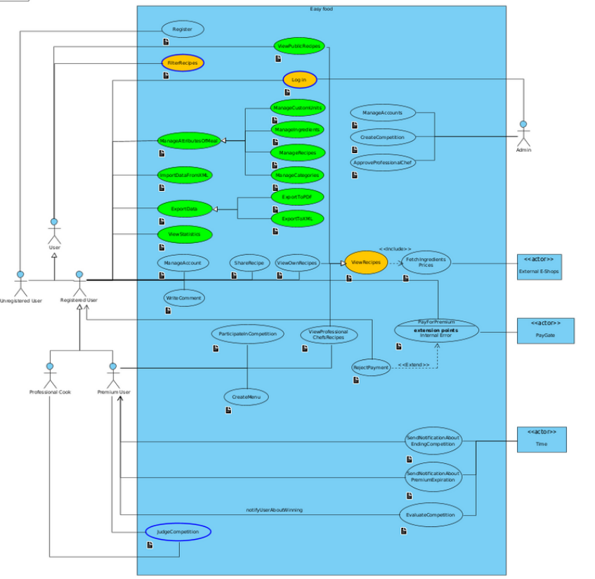

# PV168 Project: Easy food

## Introduction

Welcome to Easy Food, a user-friendly desktop application designed to simplify the process of creating, managing, and editing your own recipes. Whether you're a seasoned chef or a novice cook, Easy Food makes it easy to organize your culinary ideas, customize ingredients, and experiment with new flavors.

### With Easy Food, you can:

- Create and store your own recipes.
- Edit and refine recipes as your cooking skills evolve.
- Customize ingredients and measurements to suit your preferences.
- Keep track of your favorite dishes and culinary creations.

### Features

- Recipe Creation: Easily create and save your own recipes with step-by-step instructions.

- Recipe Editing: Modify your recipes whenever you like, adjusting ingredients, quantities, and instructions.

- Ingredient Customization: Define custom ingredients, including name, category, and measurement units.

- Search and Sort: Quickly find recipes by name, category, or ingredients.

- Import and Export: Import or export your recipes in various formats.

## Team Information

| Seminar Group | Team |
|-------------- | ---- |
| PV168/02      | 4    |

### Members

| Role           | Person               |
|----------------|----------------------|
|Team Lead       | [Samuel Sabo](https://is.muni.cz/auth/osoba/536333) |
|Member          | [Samuel Malec](https://is.muni.cz/auth/osoba/536542) |
|Member          | [Tibor Pelegrin](https://is.muni.cz/auth/osoba/536556) |
|Member          | [Filip Timko](https://is.muni.cz/auth/osoba/536297) |

### Evaluators

| Role           | Person               |
|----------------|----------------------|
|PM              | [Michael Koudela](https://is.muni.cz/auth/osoba/485441) |
|Technical Coach | [Vilém Obrátil](https://is.muni.cz/auth/osoba/408073) |

## Diagrams
### Use case diagram

